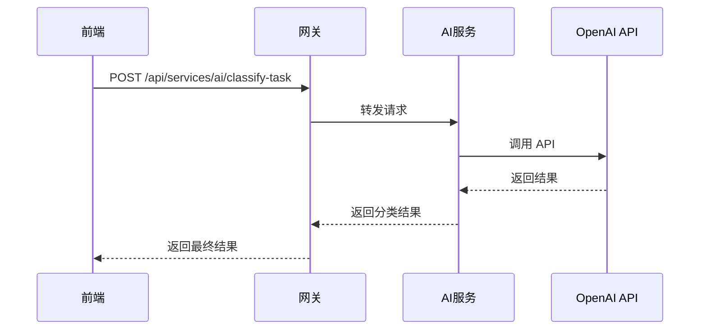
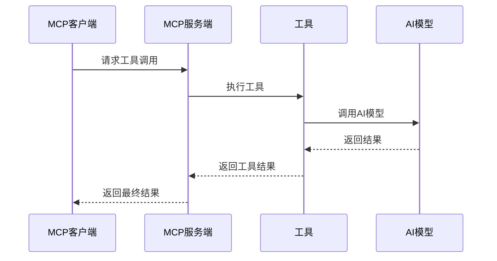

# 🤖 MCP 服务指南

## 概述

本项目基于 AI 星座运势聊天小助手项目的成功经验，集成了 MCP（Model Context Protocol）协议，实现了高度模块化的 AI 服务架构。

## 🏗️ MCP 架构

### 架构图

```
┌─────────────────┐    ┌─────────────────────────────────────┐
│   前端 (React)  │    │   后端网关 (Express)               │
│   - 用户输入    │    │   - 路由分发                       │
│   - 显示结果    │    │   - 会话管理                       │
│   - 聊天界面    │    │   - MCP 客户端                     │
└─────────┬───────┘    └─────────────┬───────────────────────┘
          │ API                      │
          │ 请求                     │
          ▼                          │
┌─────────────────┐    ┌─────────────▼───────────────────────┐
│   MCP 客户端    │    │   AI 微服务 (AI Service)           │
│   (stdio/stdout)│    │   - AI 增强解析器                  │
│   - 请求封装    │    │   - 工具调用                       │
│   - 响应解析    │    │   - 上下文管理                     │
│   - 会话状态    │    │   - 任务分类                       │
└─────────┬───────┘    └─────────────┬───────────────────────┘
          │                          │
          │ MCP 协议                 │
          ▼                          │
┌─────────────────┐    ┌─────────────▼───────────────────────┐
│   MCP 服务端    │    │   AI 模型服务                       │
│   (ai-service)  │    │   - OpenAI API                     │
│   - 工具注册    │    │   - 意图识别                       │
│   - 工具调用    │    │   - 参数提取                       │
│   - 结果返回    │    │   - 上下文理解                     │
└─────────────────┘    └─────────────────────────────────────┘
```

## 📋 MCP 服务列表

### 1. AI 服务 (ai-service)

**端口**: 3001  
**协议**: HTTP + MCP  
**功能**: AI 任务处理和自然语言理解

#### 提供的工具

##### `classify-task` - 任务分类
```json
{
  "name": "classify-task",
  "description": "Classify task into categories based on content",
  "parameters": {
    "type": "object",
    "properties": {
      "text": {
        "type": "string",
        "description": "Task description text"
      },
      "context": {
        "type": "object",
        "description": "Additional context for classification"
      }
    },
    "required": ["text"]
  }
}
```

##### `transcribe-audio` - 语音转文字
```json
{
  "name": "transcribe-audio",
  "description": "Transcribe audio to text",
  "parameters": {
    "type": "object",
    "properties": {
      "audioData": {
        "type": "string",
        "description": "Base64 encoded audio data"
      },
      "language": {
        "type": "string",
        "description": "Language code (e.g., 'zh-CN', 'en-US')",
        "default": "zh-CN"
      }
    },
    "required": ["audioData"]
  }
}
```

##### `suggest-priority` - 优先级建议
```json
{
  "name": "suggest-priority",
  "description": "Suggest priority for a task",
  "parameters": {
    "type": "object",
    "properties": {
      "task": {
        "type": "string",
        "description": "Task description"
      },
      "context": {
        "type": "object",
        "description": "Additional context for priority suggestion"
      }
    },
    "required": ["task"]
  }
}
```

##### `extract-tasks` - 任务提取
```json
{
  "name": "extract-tasks",
  "description": "Extract multiple tasks from natural language",
  "parameters": {
    "type": "object",
    "properties": {
      "text": {
        "type": "string",
        "description": "Natural language text containing tasks"
      }
    },
    "required": ["text"]
  }
}
```

### 2. 数据库服务 (db-service)

**端口**: 3002  
**协议**: HTTP  
**功能**: 数据持久化和查询

#### API 端点

- `GET /api/tasks` - 获取任务列表
- `POST /api/tasks` - 创建任务
- `PUT /api/tasks/:id` - 更新任务
- `DELETE /api/tasks/:id` - 删除任务
- `GET /api/stats` - 获取统计数据

### 3. 通知服务 (notification-service)

**端口**: 3003  
**协议**: HTTP + WebSocket  
**功能**: 推送通知和提醒

#### API 端点

- `POST /api/notifications` - 发送通知
- `GET /api/notifications/:userId` - 获取用户通知
- `PUT /api/notifications/:id/acknowledge` - 确认通知
- `POST /api/reminders` - 创建提醒

## 🔧 MCP 配置

### mcp-config.json

```json
{
  "mcp": {
    "version": "1.0.0",
    "protocol": "stdio/stdout",
    "services": {
      "ai-service": {
        "name": "ADHD Task Manager AI Service",
        "description": "AI service for task classification, priority suggestion, and voice recognition",
        "port": 3001,
        "tools": [
          "classify-task",
          "transcribe-audio",
          "suggest-priority",
          "extract-tasks"
        ],
        "aiProvider": "OpenAI",
        "model": "gpt-3.5-turbo",
        "sessionManagement": {
          "enabled": true,
          "contextRetention": "enhanced",
          "sessionId": "required"
        }
      }
    }
  }
}
```

## 🚀 部署配置

### Docker Compose

```yaml
version: '3.8'

services:
  ai-service:
    build:
      context: ./services/ai-service
      dockerfile: Dockerfile
    ports:
      - "3001:3001"
    environment:
      - NODE_ENV=production
      - PORT=3001
      - OPENAI_API_KEY=${OPENAI_API_KEY}
      - OPENAI_MODEL=gpt-3.5-turbo
    restart: unless-stopped
```

### Vercel 配置

```json
{
  "version": 2,
  "routes": [
    {
      "src": "/api/services/(.*)",
      "dest": "https://your-backend.up.railway.app/api/services/$1"
    }
  ]
}
```

### Railway 配置

```toml
[env]
AI_SERVICE_PORT = "3001"
OPENAI_API_KEY = ""
OPENAI_MODEL = "gpt-3.5-turbo"

[healthcheck]
path = "/api/health"
interval = 30
timeout = 5
retries = 3
```

## 🔄 通信流程

### 1. 前端请求流程



### 2. MCP 工具调用流程



## 📊 会话管理

### Session ID 机制

- **唯一标识**: 每个用户会话都有唯一的 sessionId
- **上下文保持**: 会话期间保持用户偏好和历史
- **状态同步**: 多服务间同步会话状态

### 上下文管理

```javascript
{
  "sessionId": "user-123-session-456",
  "context": {
    "userPreferences": {
      "language": "zh-CN",
      "theme": "light"
    },
    "taskHistory": [
      "task-1",
      "task-2"
    ],
    "aiToolCalls": [
      {
        "tool": "classify-task",
        "result": "work",
        "timestamp": "2025-12-02T17:00:00Z"
      }
    ]
  }
}
```

## 🔍 监控和调试

### 健康检查

```bash
# 检查所有服务
curl http://localhost:3000/api/health
curl http://localhost:3001/api/health
curl http://localhost:3002/api/health
curl http://localhost:3003/api/health
```

### 日志查看

```bash
# Docker 日志
docker-compose logs ai-service
docker-compose logs db-service
docker-compose logs notification-service

# Railway 日志
railway logs --service ai-service
railway logs --service db-service
railway logs --service notification-service
```

### 性能监控

- **响应时间**: < 1.5s
- **并发处理**: 支持多用户同时使用
- **错误率**: < 1%

## 🚨 故障排除

### 常见问题

1. **AI 服务不可用**
   - 检查 `OPENAI_API_KEY` 配置
   - 确认 OpenAI API 配额
   - 查看服务日志

2. **MCP 通信失败**
   - 检查端口配置
   - 验证协议设置
   - 确认服务状态

3. **会话丢失**
   - 检查 sessionId 传递
   - 验证上下文存储
   - 查看日志记录

### 调试工具

```bash
# 验证部署
./verify-deployment.sh

# 检查服务状态
curl http://localhost:3001/api/health

# 测试 AI 工具
curl -X POST http://localhost:3001/api/classify-task \
  -H "Content-Type: application/json" \
  -d '{"text": "需要完成项目报告", "context": {}}'
```

## 📚 参考文档

- [MCP 官方文档](https://github.com/modelcontextprotocol)
- [OpenAI API 文档](https://platform.openai.com/docs/api-reference)
- [Docker 部署指南](https://docs.docker.com/)
- [Vercel 部署指南](https://vercel.com/docs)
- [Railway 部署指南](https://docs.railway.app/)

---

**注意**: 本项目基于 AI 星座运势聊天小助手项目的成功经验构建，采用了相同的 MCP 架构和部署策略。